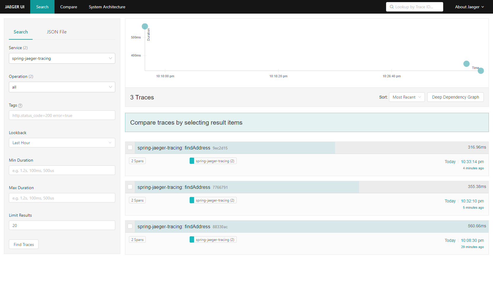
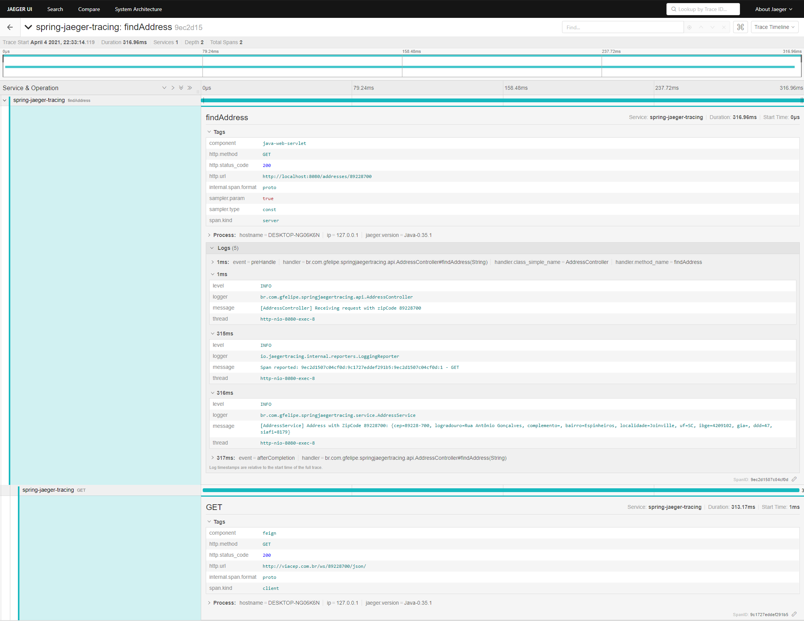

# spring-jaeger-tracing

A simple example showing how to apply distributed tracing in a Spring Boot application using [Jaeger](https://www.jaegertracing.io/).

##### What is Jaeger?
> Jaeger, inspired by Dapper and OpenZipkin, is a distributed tracing system released as open source by Uber Technologies. It is used for monitoring and troubleshooting microservices-based distributed systems.

Access [Jaeger documentation](https://www.jaegertracing.io/docs/1.22/) for mor information.

### Requirements
- Java 11
- Docker and Docker Compose

### Docker

The project uses **docker-compose** to configure and run Jaeger service.

#### Jaeger

```yaml
  jaeger:
    image: jaegertracing/all-in-one:latest
    ports:
      - 5775:5775/udp
      - 16686:16686
```

Access [Jaeger Getting Started](https://www.jaegertracing.io/docs/1.22/getting-started/) for more details.   

### Running the project

#### Setting up the environment
 
1) Clone the project;
2) Open a bash window inside the project root folder;
3) Run ``docker-compose up`` command;
4) Start the spring application;

**Obs**: Remember to start Docker before running

#### Making requests

To generate traces, use the API below:

 ```
[GET] http://localhost:8080/addresses/89228700
 ```

#### Visualizing traces

- Access the [Jaeger UI](http://localhost:16686/search);
- Select the service (spring-jaeger-tracing);
- Click ``Find Traces``;


#### Find Traces View



#### Full Trace View

